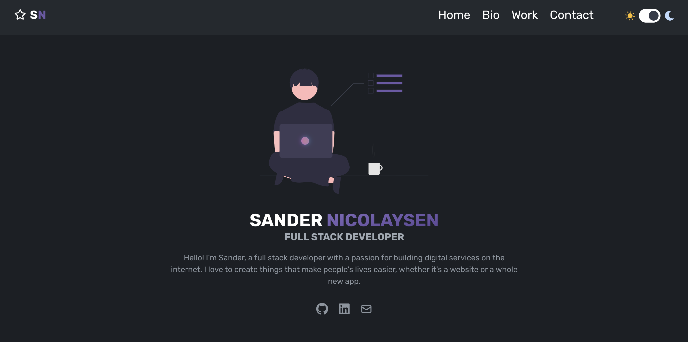

  

<h1 align="center">
  sandernicolaysen.com
</h1>

  Built with <a href="https://reactjs.org/" target="_blank">React</a> and hosted with <a href="https://firebase.google.com/" target="_blank">Firebase</a>

  
  

## Technologies
- React
- Tailwind
- Framer Motion
- Firebase

